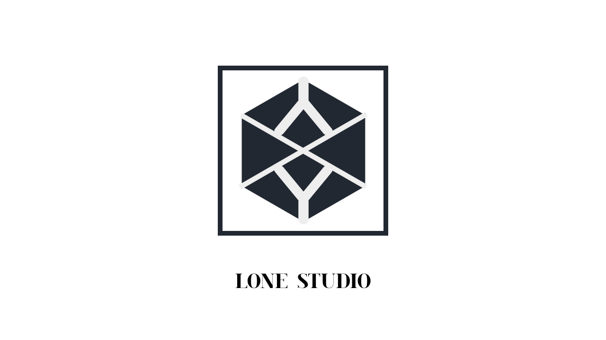

<a name="readme-top">

<br/>

<br />
<div align="center">
  <a href="https://github.com/zyx-0314/">
  <!-- TODO: If you want to add logo or banner you can add it here -->
     
  </a>
<!-- TODO: Change Title to the name of the title of your Project -->
  <h3 align="center">WD-HandsOn2</h3>
</div>
<!-- TODO: Make a short description -->
<div align="center">
  This is the Hands on 2 of Xylon Nicholas N. Santos - TW04
</div>

<br />

<!-- TODO: Change the zyx-0314 into your github username  -->
<!-- TODO: Change the WD-Template-Project into the same name of your folder -->


---

<br />
<br />

<!-- TODO: If you want to add more layers for your readme -->
<details>
  <summary>Table of Contents</summary>
  <ol>
    <li>
      <a href="#overview">Overview</a>
      <ol>
        <li>
          <a href="#key-components">Key Components</a>
        </li>
        <li>
          <a href="#technology">Technology</a>
        </li>
      </ol>
    </li>
    <li>
      <a href="#rule,-practices-and-principles">Rules, Practices and Principles</a>
    </li>
    <li>
      <a href="#resources">Resources</a>
    </li>
  </ol>
</details>

---

## Overview

<!-- TODO: To be changed -->
<!-- The following are just sample -->
Description of the project in details.

- This project is a web-based showcase featuring five different hero styles, five static card styles, and five animated card styles. The project aims to provide a visually appealing and interactive experience for users, demonstrating various web design techniques and CSS animations. It is divided into two main sections: the Hero Gallery and the Card Gallery, each accessible via navigation links on the landing page.

Guiding Question:
- What is the project - The project is a web-based interface showcasing different hero and card styles using HTML, CSS, and animation effects. It includes both static and animated elements to demonstrate a range of design possibilities.

- Whats the purpose - The purpose of the project is to display a variety of hero and card styles to inspire and inform users about different design approaches and CSS animation techniques. 

- What are key components - The key components are the Hero Gallery and the Card Gallery. The Hero Gallery displays different hero section designs, while the Card Gallery showcases various static and animated card designs.

### Key Components
<!-- TODO: List of Key Components -->
<!-- The following are just sample -->
- Landing Page
- Hero Gallery
- Card Gallery

### Technology
<!-- TODO: List of Technology Used -->


## Rules, Practices and Principles
1. Always use `WD-` in the front of the Title of the Project for the Subject followed by your custom naming.
2. Do not rename any .html files; always use `index.html` as the filename.
3. Place Files in their respective folders.
4. All file naming are in camel case.
   - Camel case is naming format where there is no white space in separation of each words, the first word is in all lower case while the succeding words first letter are in upper followed by lower cased letters.
   - ex.: buttonAnimatedStyle.css
5. Use only `External CSS`.
6. Renaming of Pages folder names are a must, and relates to what it is doing or data it holding.
7. File Structure to follow below.

```
WD-ProjectName
└─ assets
|   └─ css
|   |   └─ style.css
|   └─ img
|   |   └─ fileWith.jpeg/.jpg/.webp/.png
|   └─ js
|       └─ script.js
└─ pages
|  └─ pageName
|     └─ assets
|     |  └─ css
|     |  |  └─ style.css
|     |  └─ img
|     |  |  └─ fileWith.jpeg/.jpg/.webp/.png
|     |  └─ js
|     |     └─ script.js
|     └─ index.html
└─ index.html
└─ readme.md
```

## Resources

<!-- TODO: Add References -->
| Title | Purpose | Link |
|-|-|-|
| HTML Tutorial | HTML Tutorial of the basics | https://www.w3schools.com/html/ |
| CSS Tutorial | CSS Tutorial of the basics | https://www.w3schools.com/css/ |
